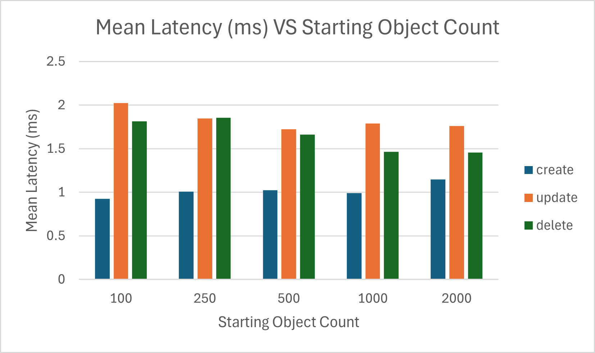
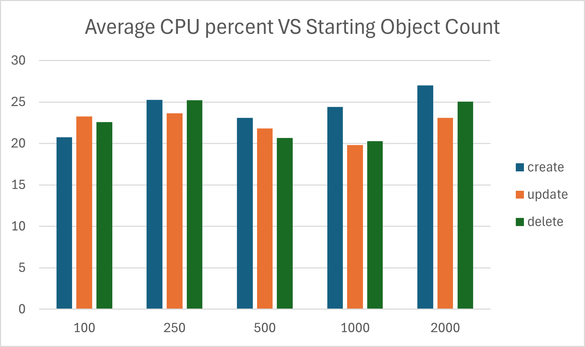
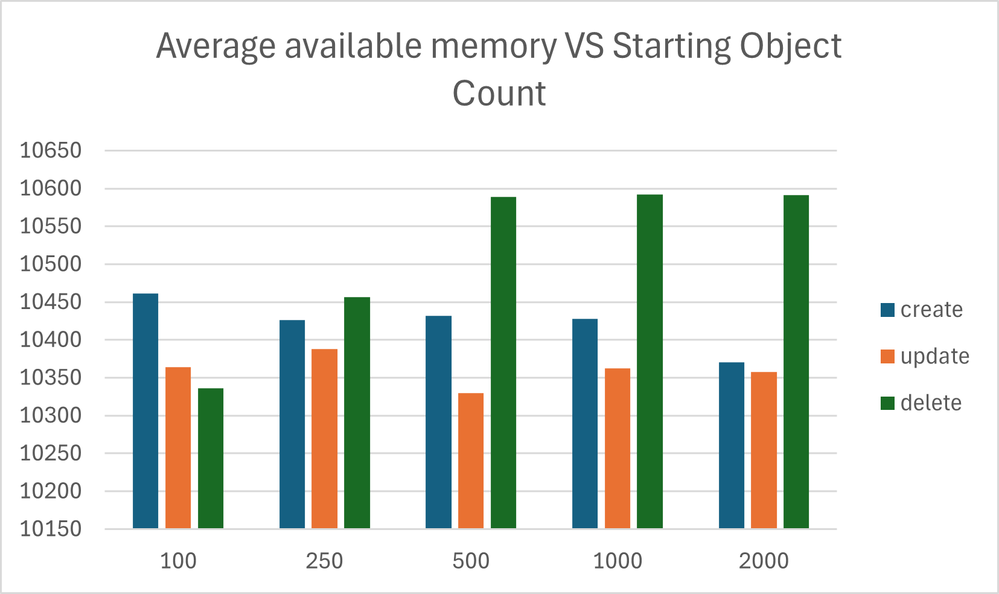
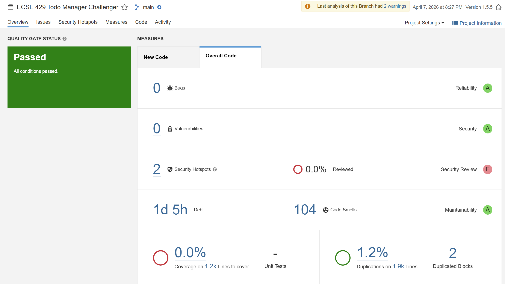

# ECSE 429 Part C Report - Non-Functional Testing of REST API (Todo Manager)

**Course:** ECSE 429 - Software Validation (Winter 2026)  
**Part:** C - Non-Functional Testing of REST API  
**Team:** Benzaid Mohamed-Amine  
**Student ID:** 261120610  
**Email:** mohamed-amine.benzaid@mail.mcgill.ca  
**Date:** 2026-04-07  
**Repo Link:** https://github.com/BENZzz213/ECSE-429-Testing-Project/tree/main

---

## Repository Overview

This Part C submission is organized under `Part C - Non-Functional Testing/` and contains:

- `performance-suite/` - standalone Java performance harness for the todo API
- `scripts/run-performance-tests.ps1` - orchestration script for API startup, experiment execution, and result aggregation
- `scripts/sample-windows-counters.ps1` - CPU and memory sampling script for dynamic analysis
- `scripts/run-sonarqube-analysis.ps1` - SonarQube 9.9 execution script for static analysis
- `results/transactions/` - raw per-request transaction timings
- `results/system-metrics/` - raw CPU and available-memory samples
- `results/summary/` - per-run latency summaries and final combined summary CSV
- `thingifier-1.5.5/challenger/` - Java source analyzed for the static-analysis portion
- `sonar-project.properties` - SonarQube project configuration

---

## Executive Summary

Part C extends the earlier functional testing work by evaluating the Todo Manager REST API from a non-functional perspective. Two complementary activities are implemented:

1. **Performance testing using dynamic analysis**
2. **Static analysis of the Java source code**

The performance suite measures transaction latency for the core todo operations `create`, `update`, and `delete` while the number of objects in the system increases. In parallel, Windows performance counters are sampled to record CPU usage and available free memory during each run. The combined results are written to CSV files so they can be charted directly in Excel.

The static-analysis portion targets the repo-local `challenger` source module from `thingifier-1.5.5`, which contains the Todo Manager API model, route setup, and API response hooks. SonarQube 9.9 Community is used to identify complexity, maintainability issues, and technical risks that may affect future modifications.

---

## Performance Test Suite Implementation

### Scope

The dynamic analysis focuses on these todo operations:

- `POST /todos`
- `PUT /todos/{id}`
- `DELETE /todos/{id}`

The scope remains aligned with the single-member `todos` focus from Parts A and B.

### Harness Design

The performance harness is implemented as a standalone Java project in `performance-suite/`. It uses the same direct HTTP style as the Part A support code but moves that logic into a non-test client designed for scripted performance runs.

The Java runner:

- verifies that the API is reachable before a run starts
- seeds the API to a requested starting object count
- generates random todo titles and descriptions for each request
- executes warm-up iterations before measurement
- times each HTTP operation using `System.nanoTime()`
- records raw per-request latency to CSV
- records latency summary statistics for each run

### Experiment Matrix

The default experiment sizes are:

- `100`
- `250`
- `500`
- `1000`
- `2000`

For each starting count and for each operation type:

- warm-up iterations used for the final reported run: `100`
- measured iterations used for the final reported run: `1000`

The orchestration script restarts the API between runs so that each experiment begins from a fresh application state.

### Dynamic Analysis Metrics

The PowerShell counter-sampling script records:

- `\Processor(_Total)\% Processor Time`
- `\Memory\Available MBytes`

These samples are written to CSV while each run is active. After the run completes, the orchestration script combines the transaction summary with:

- average CPU percent
- average available memory
- minimum available memory

### Output Files

Generated output files are written under `results/`:

- `transactions/` - raw request timings
- `system-metrics/` - Windows counter samples
- `summary/` - latency summaries and the master combined summary CSV

The main chart source file is expected to be:

- `results/summary/performance-summary.csv`

---

## How To Execute Part C

### Performance Test Suite

Run the full performance experiment set with:

```powershell
powershell -ExecutionPolicy Bypass -File ".\Part C - Non-Functional Testing\scripts\run-performance-tests.ps1"
```

Optional parameters can override:

- jar path
- base URL
- starting counts
- warm-up iterations
- measured iterations
- sampling interval

### Static Analysis

Run SonarQube analysis with:

```powershell
powershell -ExecutionPolicy Bypass -File ".\Part C - Non-Functional Testing\scripts\run-sonarqube-analysis.ps1" `
  -SonarHostUrl "http://localhost:9000" `
  -SonarToken "<sonarqube_user_token>"
```

The static-analysis target is:

- `thingifier-1.5.5/challenger/src/main/java`

and the highest-priority review files are:

- `challengehooks/ChallengerApiResponseHook.java`
- `ChallengeRouteHandler.java`
- `ChallengeMain.java`

---

## Results

### Performance Results

The final reported experiment set was generated from:

- `100` warm-up operations per run
- `1000` measured operations per run
- starting object counts of `100`, `250`, `500`, `1000`, and `2000`

The chart source file is:

- `results/summary/performance-summary.csv`

#### Mean Latency vs Starting Object Count



Observed results:

- `create` remained the fastest operation, ranging from `0.924 ms` to `1.148 ms`
- `update` was consistently the slowest operation, ranging from `1.725 ms` to `2.024 ms`
- `delete` ranged from `1.455 ms` to `1.856 ms`
- no strong latency growth trend was observed as the number of starting objects increased from `100` to `2000`

This suggests that, within the tested range, the Todo Manager API maintained low request latency and did not show obvious performance degradation as object count increased.

#### Average CPU Percent vs Starting Object Count



Observed results:

- average CPU usage stayed in a moderate range of about `19.8%` to `27.0%`
- none of the three operations showed sustained CPU escalation as object count increased
- `create` reached the highest observed CPU average at the `2000` object run, but the overall CPU pattern remained stable rather than sharply increasing

The CPU results indicate that the test workload exercised the application without pushing the machine into high sustained processor usage.

#### Average Available Memory vs Starting Object Count



Observed results:

- average available memory remained stable, roughly between `10.3 GB` and `10.6 GB`
- no run showed evidence of large memory loss or progressive depletion as object count increased
- the measurements suggest that the application did not create visible memory pressure during these experiments

Across the tested range, memory behavior remained stable and there was no sign of a severe memory-related bottleneck.

### Static Analysis Results

SonarQube 9.9 Community was run against the `thingifier-1.5.5/challenger` module. The project-level summary reported:

- Quality Gate: `Passed`
- Bugs: `0`
- Vulnerabilities: `0`
- Security Hotspots: `2`
- Reliability Rating: `A`
- Security Rating: `A`
- Maintainability Rating: `A`
- Code Smells: `104`
- Technical Debt: `1d 5h`
- Duplications: `1.2%`
- Duplicated Blocks: `2`
- Coverage: `0.0%`



The overall ratings show that the code base is not failing the quality gate, but the number of code smells and the estimated technical debt still indicate maintainability work that would reduce future change risk.

The most relevant findings for this project were concentrated in the files below.

#### ChallengerApiResponseHook.java

SonarQube identified this class as the main maintainability hotspot.

- The main response-hook method has cognitive complexity `42`, exceeding the allowed threshold of `15`
- Several string literals are duplicated repeatedly instead of being extracted into constants:
  - `"todos/.*"`
  - `"todos"`
  - `"application/xml"`
  - `"application/json"`
  - `"doneStatus"`
- multiple TODO comments remain in the code
- one finding recommends using `StringBuilder` instead of less efficient string concatenation patterns


These findings indicate that too much behavior is concentrated in a single hook class, making it harder to modify safely and easier to introduce regressions.

#### ChallengeMain.java

SonarQube reported repeated major code smells in the startup class:

- multiple uses of `System.out` or `System.err`
- recommendation to replace direct console output with a proper logger


This matters because startup and operational messages should be consistent, configurable, and easier to control in different environments.

#### ChallengeRouteHandler.java

SonarQube flagged maintainability and style issues in the route setup class:

- a block of commented-out code should be removed
- the field `single_player_mode` does not match the expected naming convention


These are smaller issues than the hook complexity problem, but they still suggest that route configuration code would benefit from cleanup and better consistency.

---

## Performance Risks and Code Recommendations

The performance results did not show a severe risk within the tested range of `100` to `2000` starting objects. Request latency stayed low for all three operations, CPU use remained moderate, and available memory stayed stable. However, the results still support a few practical recommendations:

- `update` should be treated as the highest-priority operation for future optimization because it was consistently the slowest of the three measured operations
- future changes should be benchmarked again if the API begins storing much larger todo sets, because this experiment only covered up to `2000` starting objects
- if performance monitoring becomes a recurring need, a more detailed profiling setup should be added to supplement OS-level counters, since CPU and memory sampling is coarser than per-request timing
- classes that centralize request/response behavior should be kept small and modular, because concentrated logic increases the chance that future enhancements create latency regressions that are harder to isolate

---

## Static Analysis Recommendations

Based on the SonarQube findings, the following changes are recommended to reduce future maintenance risk.

### 1. Refactor `ChallengerApiResponseHook`

- split the large response-processing method into smaller helper methods grouped by responsibility
- extract repeated literals such as endpoint names, content types, and field names into named constants
- remove or resolve outstanding TODO comments
- replace repeated string concatenation with `StringBuilder` where appropriate

This is the highest-priority refactoring target because SonarQube reported critical complexity and repeated duplication in this file.

### 2. Replace console output in `ChallengeMain`

- replace `System.out` and `System.err` calls with a logging framework or a centralized logger abstraction
- keep startup logging structured and consistent

This will improve maintainability and make operational output easier to manage during debugging, testing, and deployment.

### 3. Clean up `ChallengeRouteHandler`

- remove commented-out code instead of keeping dead code blocks in the active source
- rename `single_player_mode` to a naming-convention-compliant identifier
- consider extracting route setup into smaller helper methods if this class continues to grow

This cleanup reduces noise in a central configuration class and makes route setup easier to read and modify.

### 4. Review the two security hotspots

- the project dashboard reported `2` security hotspots
- these should be reviewed manually even though there were `0` reported vulnerabilities

A clean vulnerability count does not remove the need to inspect security hotspots, especially in a REST API project.

---

## Clean Code Summary

This implementation follows the main Bob Martin guidelines emphasized in the project brief:

- small classes with focused responsibilities
- descriptive naming
- minimal side effects in helper methods
- readable orchestration scripts with explicit setup and cleanup
- separation of performance execution, metric sampling, and static-analysis concerns

---

## Conclusion

Part C is implemented with a reusable performance harness, automated dynamic-analysis scripts, and a SonarQube-ready static-analysis workflow targeted at the available Java source. The final performance run showed low and stable request latency across the tested object counts, moderate CPU usage, and stable available memory. The static-analysis results showed acceptable overall project ratings, but also identified clear maintainability improvement opportunities, especially in `ChallengerApiResponseHook`, `ChallengeMain`, and `ChallengeRouteHandler`.
